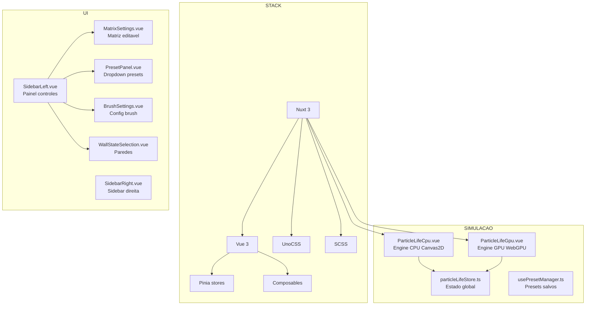
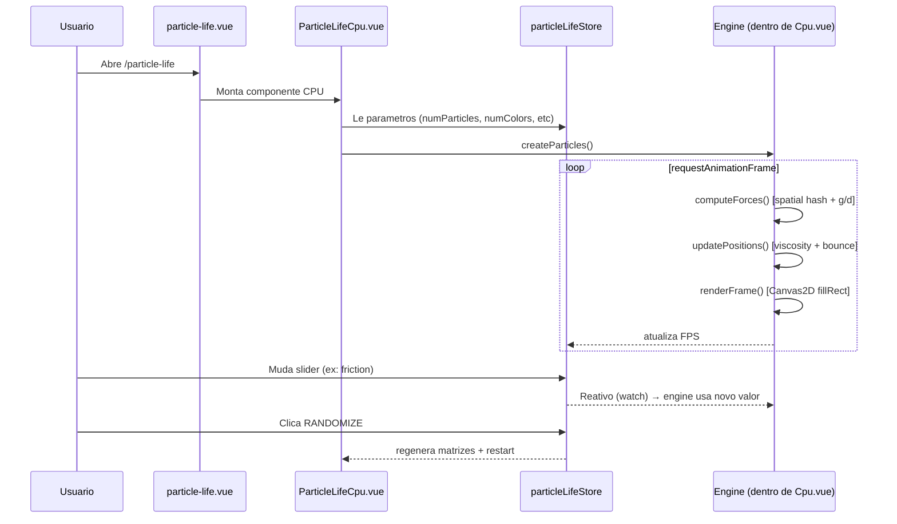

# MAPA DO CODEBASE — SANDBOXSCIENCE FORK
## Para IAs que vao trabalhar neste projeto
### Leia este arquivo PRIMEIRO antes de tocar em qualquer codigo

---

## VISAO GERAL



---

## ARVORE DE PASTAS

```
SandboxScience/
├── app.vue                    # Root Vue component
├── nuxt.config.ts             # Config Nuxt (plugins, CSS, meta)
├── package.json               # Deps: Nuxt3, Vue3, Pinia, UnoCSS
├── uno.config.ts              # UnoCSS (Tailwind-like utility CSS)
│
├── pages/                     # ROTAS (Nuxt file-based routing)
│   ├── index.vue              # Homepage
│   ├── particle-life.vue      # PAGINA PRINCIPAL — onde tudo acontece
│   ├── game-of-life.vue       # Outro simulador (nao relevante)
│   ├── hash-life.vue          # Outro simulador (nao relevante)
│   └── about.vue              # Sobre
│
├── layouts/                   # Layouts Nuxt
│   ├── default.vue            # Layout padrao (com navbar)
│   └── life.vue               # Layout limpo (sem navbar, para simulacao)
│
├── stores/                    # PINIA — estado global reativo
│   ├── particleLifeStore.ts   # ★ PRINCIPAL — todos parametros da simulacao
│   ├── particleLifeGPUStore.ts # Parametros extras do GPU
│   ├── gameStore.ts           # Game of Life (ignorar)
│   └── quadStore.ts           # QuadTree (ignorar)
│
├── components/
│   ├── particle-life/         # ★ COMPONENTES CORE
│   │   ├── ParticleLifeCpu.vue    # ★★★ ENGINE CPU — toda a fisica + render
│   │   ├── ParticleLifeGpu.vue    # Engine GPU (WebGPU, complexo)
│   │   ├── MatrixSettings.vue     # ★ Painel da matriz de forcas
│   │   ├── RulesMatrix.vue        # Grid visual da matriz
│   │   ├── MinMatrix.vue          # Grid visual raio minimo
│   │   ├── MaxMatrix.vue          # Grid visual raio maximo
│   │   ├── PresetPanel.vue        # ★ Dropdown + botoes de presets
│   │   ├── MyPresets.vue          # Presets salvos pelo usuario
│   │   ├── BrushSettings.vue      # ★ Config do brush (add/remove/attract/repulse)
│   │   ├── WallStateSelection.vue # None/Repel/Wrap
│   │   ├── WrapModeSelection.vue  # Normal/Edges/Infinite
│   │   ├── Memory.vue             # Display de memoria usada
│   │   ├── SaveModal.vue          # Modal salvar preset
│   │   ├── ShareOptions.vue       # Compartilhar config
│   │   ├── CaptureOverlay.vue     # Overlay para captura GIF/screenshot
│   │   ├── TrackerOverlay.vue     # Overlay do tracker de criaturas
│   │   ├── TrackerToggle.vue      # Toggle tracker on/off
│   │   └── DevicesGpuTips.vue     # Dicas de GPU
│   │
│   ├── SidebarLeft.vue        # ★ Container do painel esquerdo
│   ├── SidebarRight.vue       # Container painel direito (botoes flutuantes)
│   ├── NavBar.vue             # Barra de navegacao superior
│   ├── Collapse.vue           # ★ Componente colapsavel (usado em tudo)
│   ├── RangeInput.vue         # ★ Slider com input numerico
│   ├── RangeInputMinMax.vue   # Slider com min/max
│   ├── SelectButton.vue       # Botao de selecao
│   ├── SelectInput.vue        # Dropdown
│   ├── SelectMenu.vue         # Menu de selecao
│   ├── ToggleSwitch.vue       # Toggle on/off
│   ├── ToggleChip.vue         # Chip toggleavel
│   ├── TooltipInfo.vue        # Tooltip com icone (i)
│   ├── Input.vue              # Input generico
│   ├── Modal.vue              # Modal generico
│   ├── Dropdown.vue           # Dropdown generico
│   ├── JsonEditor.vue         # Editor de JSON (presets)
│   ├── AppToasts.vue          # Notificacoes toast
│   └── DonationModal.vue      # Modal de doacao (remover)
│
├── composables/               # Logica reutilizavel
│   ├── usePresetManager.ts    # ★ Gerencia presets (load/save/delete)
│   ├── useToasts.ts           # Sistema de notificacoes
│   └── useDonationModal.ts    # Doacao (remover)
│
├── helpers/utils/             # Funcoes utilitarias
│   ├── colorsGenerator.ts     # ★ Gera paletas de cores
│   ├── rulesGenerator.ts      # ★ Gera matrizes aleatorias
│   ├── positionsGenerator.ts  # ★ Distribui particulas no espaco
│   ├── themes.ts              # Temas de cor
│   └── naiveLife.ts           # Game of Life (ignorar)
│
├── constants/
│   └── index.ts               # Constantes globais
│
├── assets/
│   ├── scss/main.scss         # CSS global
│   └── particle-life-gpu/     # Shaders WebGPU (nao mexer inicialmente)
│       ├── shaders/compute/   # Shaders de computacao (fisica GPU)
│       ├── shaders/render/    # Shaders de render (visual GPU)
│       └── shaders/compose/   # Composicao de imagem
│
├── server/
│   └── api/pageView.ts        # Analytics (remover ou ignorar)
│
└── public/                    # Arquivos estaticos
    ├── favicon.ico
    └── ...
```

---

## FLUXO DA SIMULACAO (CPU)



---

## STORE PRINCIPAL (particleLifeStore.ts)

```mermaid
graph LR
    subgraph "Parametros Mundo"
        NP[numParticles: 6000]
        NC[numColors: 7]
        GW[gridWidth]
        GH[gridHeight]
    end

    subgraph "Fisica"
        RP[repel: 1]
        FF[forceFactor: 1.0]
        FR[frictionFactor: 0.3]
        MR1[minRadiusRange: 30-60]
        MR2[maxRadiusRange: 90-150]
    end

    subgraph "Matrizes"
        RM[rulesMatrix: number[][]]
        MN[minRadiusMatrix: number[][]]
        MX[maxRadiusMatrix: number[][]]
        CL[currentColors: number[][]]
    end

    subgraph "Visual"
        PS[particleSize: 8]
        WR[isWallRepel: true]
        WW[isWallWrap: false]
        D3[is3D: true]
    end

    subgraph "Brush"
        BA[isBrushActive]
        BT[brushType: 0=Add 1=Remove]
        BR[brushRadius: 300]
        BI[brushIntensity: 10]
        AF[attractForce: 10]
        RF[repulseForce: 10]
    end
```

---

## ONDE MEXER PARA CADA OBJETIVO

### Quero mudar os TIPOS de particula (de cores para segmentos eleitorais)
```
ARQUIVO: helpers/utils/colorsGenerator.ts
ARQUIVO: stores/particleLifeStore.ts (currentColors, numColors)
ARQUIVO: components/particle-life/MatrixSettings.vue (nomes das colunas)
```

### Quero adicionar PRESETS eleitorais
```
ARQUIVO: composables/usePresetManager.ts (estrutura do preset)
ARQUIVO: components/particle-life/PresetPanel.vue (dropdown UI)
CRIAR: dados dos presets em constants/ ou helpers/
```

### Quero mudar a FISICA
```
ARQUIVO: components/particle-life/ParticleLifeCpu.vue
FUNCOES: computeForces(), getForce(), updatePositions()
STORE: particleLifeStore.ts (repel, forceFactor, frictionFactor)
```

### Quero adicionar STAKEHOLDERS (particulas grandes)
```
ARQUIVO: components/particle-life/ParticleLifeCpu.vue (render + fisica)
STORE: particleLifeStore.ts (novo array stakeholders)
UI: criar componente StakeholderPanel.vue em components/particle-life/
```

### Quero adicionar EVENTOS eleitorais
```
CRIAR: components/particle-life/EventPanel.vue
STORE: particleLifeStore.ts (novo array events, metodo applyEvent)
UI: botoes no SidebarLeft
```

### Quero adicionar METRICAS (votos JE, polarizacao)
```
CRIAR: components/particle-life/MetricsPanel.vue
STORE: particleLifeStore.ts (computed metrics)
UI: barra inferior ou secao no sidebar
```

### Quero mudar o VISUAL (marca INTEIA, cores douradas)
```
ARQUIVO: assets/scss/main.scss (cores globais)
ARQUIVO: components/particle-life/ParticleLifeCpu.vue (titulo, header)
ARQUIVO: layouts/life.vue (layout da pagina)
```

### Quero mudar os NOMES (de "Species" para "Segmentos")
```
GREP: "Species" "Color" "Particle" em todos .vue e .ts
SUBSTITUIR por: "Segmento" "Cluster" "Eleitor"
```

---

## ARQUIVOS QUE NAO PRECISA MEXER (inicialmente)

```
assets/particle-life-gpu/    # Shaders WebGPU — so GPU, complexo
components/game-of-life/     # Outro simulador
pages/game-of-life.vue       # Outro simulador
pages/hash-life.vue          # Outro simulador
stores/gameStore.ts           # Outro simulador
stores/quadStore.ts           # Outro simulador
helpers/utils/naiveLife.ts    # Outro simulador
server/api/pageView.ts       # Analytics
components/DonationModal.vue  # Doacao
composables/useDonationModal.ts # Doacao
```

---

## COMO RODAR

```bash
cd C:\Users\IgorPC\projetos\projetos-claude\SandboxScience
npm install
npm run dev
# Abre http://localhost:3000/particle-life
```

---

## CONTEXTO ELEITORAL

Este fork sera adaptado para simulacao eleitoral de Roraima.
Documentacao completa em: `C:\Users\IgorPC\projetos\projetos-claude\lenia-eleitoral\docs-eleitoral\`

Ler na ordem:
1. `docs-eleitoral/INDICE.md` — indice de todos documentos
2. `docs-eleitoral/RORAIMA_CONSOLIDADO_INTEIA.md` — tudo sobre RR
3. `docs-eleitoral/CLUSTERS_4_JORGE_EVERTON.md` — os 4 clusters + forcas
4. `docs-eleitoral/PLANO_SIMULADOR_ELEITORAL_v3.md` — o que construir

---

*INTEIA | Fork de SandboxScience para simulacao eleitoral*
*Mapeado em 2026-03-21*
